# History
1. Single powerful server
2. Server with LoadBalancer + webservers + Databases!

    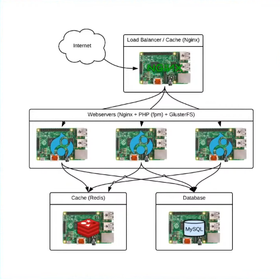 

## Kubernetes
1. Borg
2. Initially C++ port to Go later
3. 7 spoker -> Project seven 

    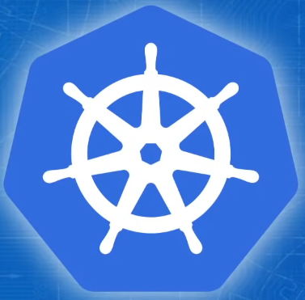

4. K8s -> pneumonim
5. CNCF
6. Complicated than Docker Compose [Docker Swarm]
7. K8s distribution: k3s, kind, minikube, k0s 
    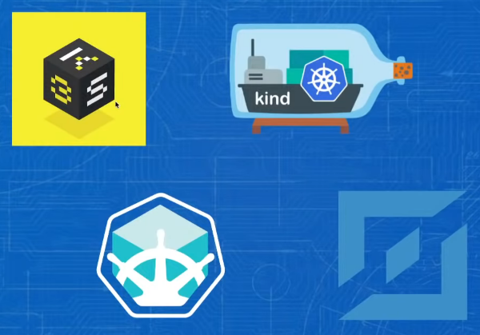

## Minikube
1. install minikube
2. install kubectl [kubi cuttle]
3. start cluster:
    ```
    $ minikube start
    ```
4. get nodes: 
    ```
    $ kubectl get nodes
    ```
5. master node would never run actual application
6. deploy an application: 
    ```
    $ kubectl create deployment hello-k8s --image=hello-world
    ```
7. expose your application to host using services:
    ```
    $ kubectl expose deployment hello-k8s --type=NodePort --port=80
    ``` 
8. get services:
   ```
   $ kubectl get services
   ```
   get specific service:
   ```
   $ kubectl get services <service-name>
   ```
9. get minikube ip addresses
    ```
    $ minikube ip
    ```
10. handy feature of minikube: find ip, find port, start app
    ```
    $ minkube service <service-name>
    ```
11. stop the cluster
    ```
    $ minikube halt
    ```
12. delete the cluster
    ```
    $ minikube delete
    ```

## Concept
- Why container?
  
  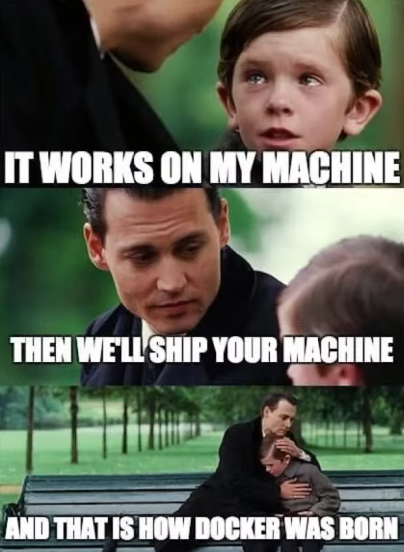
  - Build once, deploy anywhere
  - different developer work in different services of same application
  - different developer work in different machine with different os
  - Container makes common and isolated platform 
  - Portable
  - Isolated
  - Consistent
  - Lightweight

## VM vs Container
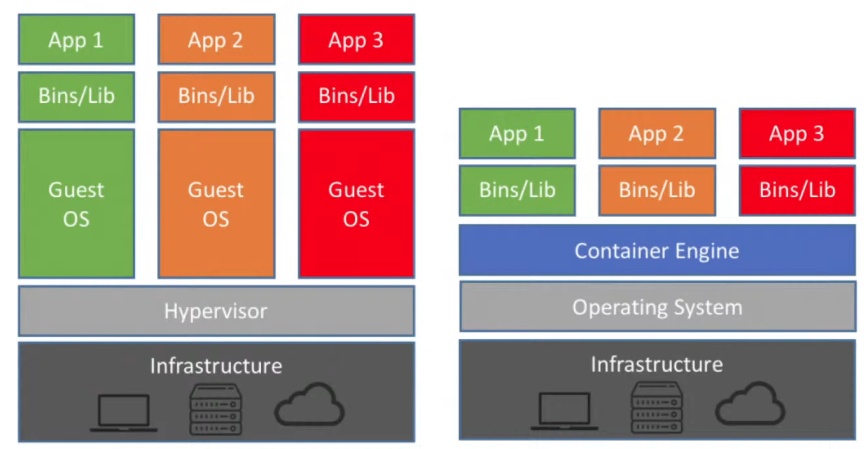

### Container history
- chroot (1979)
- freebsd jail (2001)
- solaris zones (2004)
- openvz (2005)
- process containers (2006)
- lxc (2008)
- dotcloud (2013)
- docker (2013)
- Core OS - RKT (2013)
- Open container initiative
- RUNC (2015)
- cri-o (2017)
- crun (2019)

### Building containers
- docker [does all the stuff]
- buildah [just build docker image]
  - podman [to run container]
  - crun [to run images in k8s]

### Use Docker images by minikube
```
$ eval $(minikube docker-env)
```

## Kubernetes
- get pod with label
  ```
  $ kubectl get pod -l app=<name of pod>
  ```
- get detail
  ```
  $ kubectl describe pod -l app=<name of pod>
  ```
- kubernetes secret registry
  ```
  $ kubectl create secret <registry-name> <secret-name> \
    -- secret-key=secret-value \
    -- secret-key=secret-value \
    ...
  ```
- get secret
  ```
  $ kubectl get secrets
  ```
- edit deployment
  ```
  $ kubectl edit deployment <deployment-name>
  ```
- **Note:** secrets are specific to a k8s namespace
- expose deployment using NodePort service: assigns random port to the node and expose port of node
  ```
  $ kubectl expose deployment <deployment-name> --port=<cluster-port> --target-port=<container-port> --type=NodePort
  ```
- update the deployment
  ```
  $ kubectl set image deployment/<deployment-name> <imagename>=<imagename>:<tag>
  ```
- get extra information
  ```
  $ kubectl get deployment -o wide
  $ kubectl get pod -o wide
  $ kubectl get service -o wide
  ```
- scale deployment
  ```
  $ kubectl scale --replicas=2 deployment/<deployment-name>
  ```
- delete deployment and service
  ```
  $ kubectl delete deployment <deployment-name>
  $ kubectl delete service  <service-name>
  ```
- get log [like using tail]
  ```
  $ kubectl logs -f
  ```
- to see which pod and which container are running `--prefix=true`
  ```
  $ kubectl logs -f -l app=<label> --prefix=true
  ```
- get output in yaml
  ```
  $ kubectl get svc <service-name> -o yaml
  ```
- roll back to the previous version
  ```
  $ kubectl rollout history deployment <deployment-name>
  $ kubectl rollout undo deployment <deployment-name>
  ```
- emulate external ip
  ```
  $ minikube tunnel
  ```
- use different kube config
  ```
  $ export KUBECONFIG=~/.kube/<config-file>
  ```
- create namespace
  ```
  $ kubectl create namespace <namespace-name>
  ```
- get deployment inside namespace
  ```
  $ kubectl get deployments -n <namspace-name> -w
  ```
- set default namespace
  ```
  $ kubectl config set-context --current --namespace=<namespace-name>
  ```
- drop out the namespace
  ```
  $ kubectl config set-context --current --namespace=""
  ```
- Kubernetes in nutshell 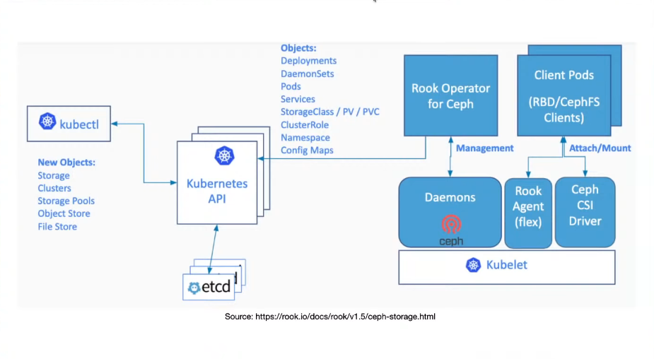
- Rook Architecture 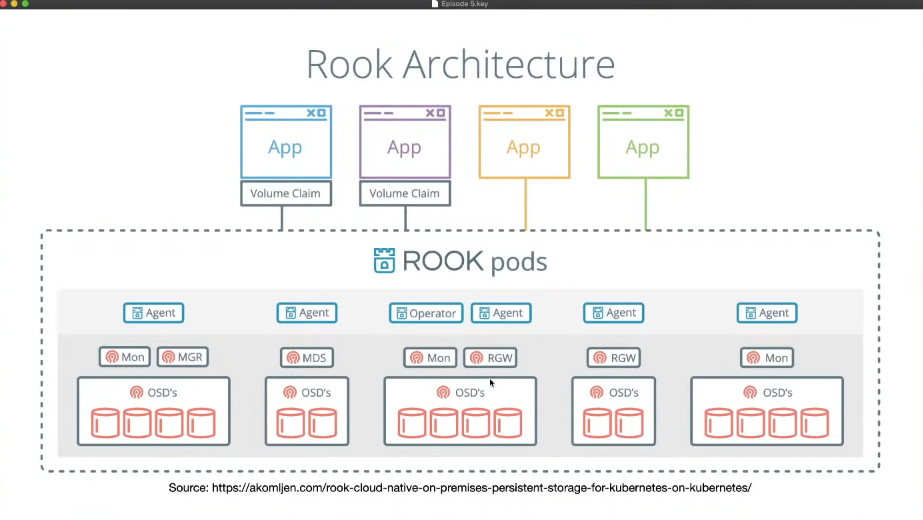
- NFS for storage 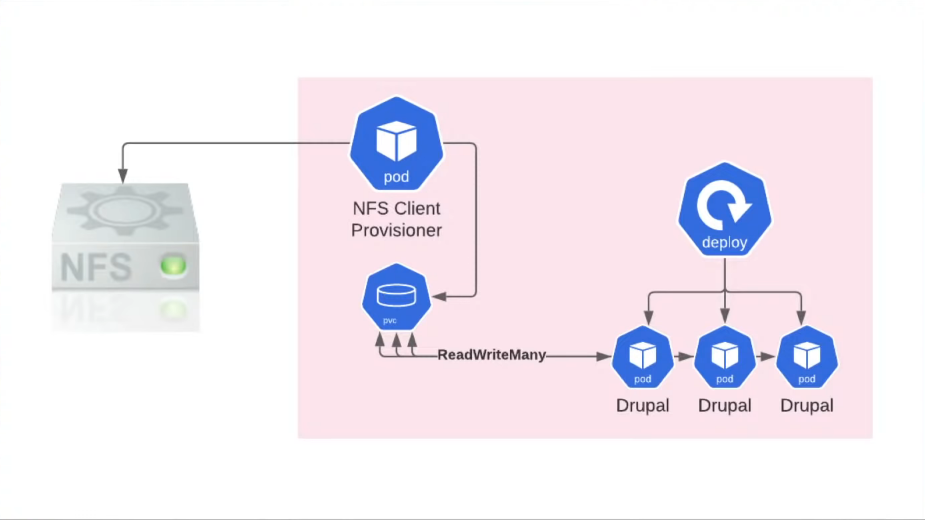

- check metrics api
  ```
  $ kubectl top nodes -n <namespace>
  ```
- auto scale depending upon CPU
  ```
  $ kubectl autoscale -n <namespace> deployment <deploy-name> --min=<min-value> --max=<max-value> --cpu-percent=<percent>
- get horizontal pod autoscale
  ```
  $ kubectl get hpa -n <namespace> <deploymentname>
  ```
- apache benchmark test
  ```
  $ ab -n <request no> -c <connection no> [-C <session cookie> "Sabc=xyx"] <url>
  ```
- scaling persistent volume 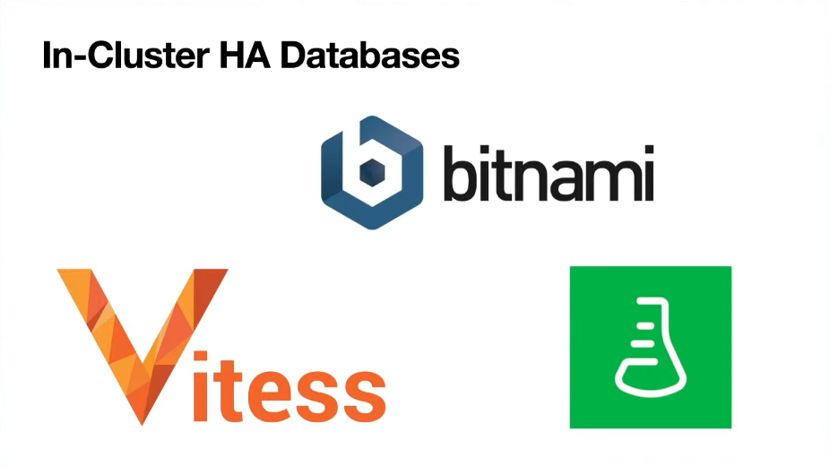
- NodePort Diagram 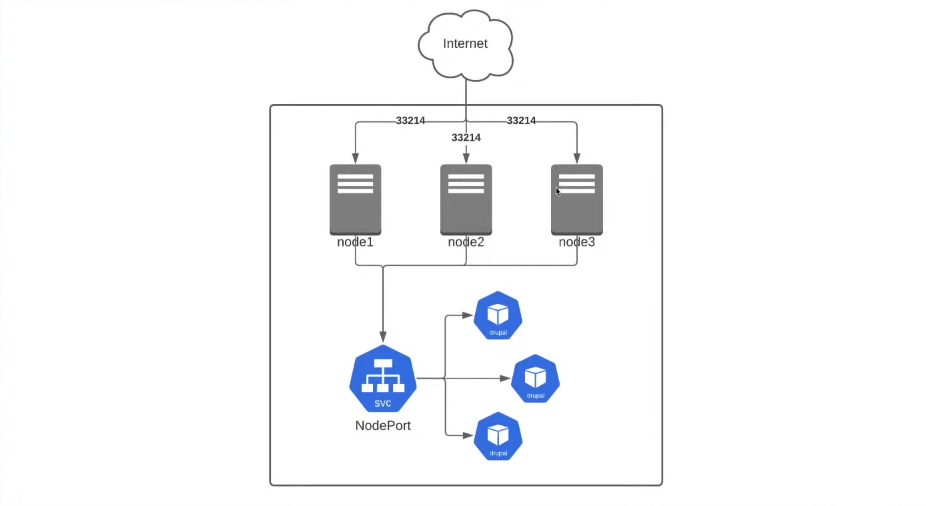

### Ingress 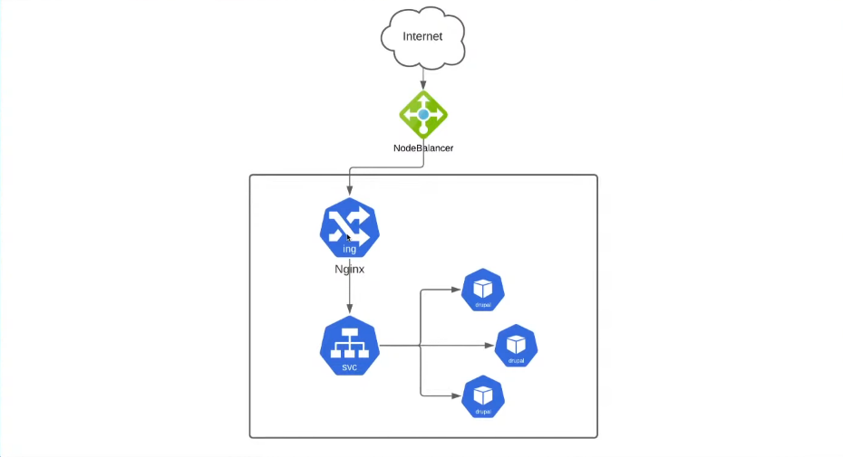
- ingress contoller
- nginx
- ha-proxy
- traefik
- envoy

### Setup Ingress
- use yaml file or helm to install ingress controller
- get information about ingress controller
  ```
  $ kubectl get svc <ingress-controller-name>
  $ kubectl get ingress[ing] -n <namespace>
  ```
- kubernetes external-dns for huge number of domain management
- TLS certificate 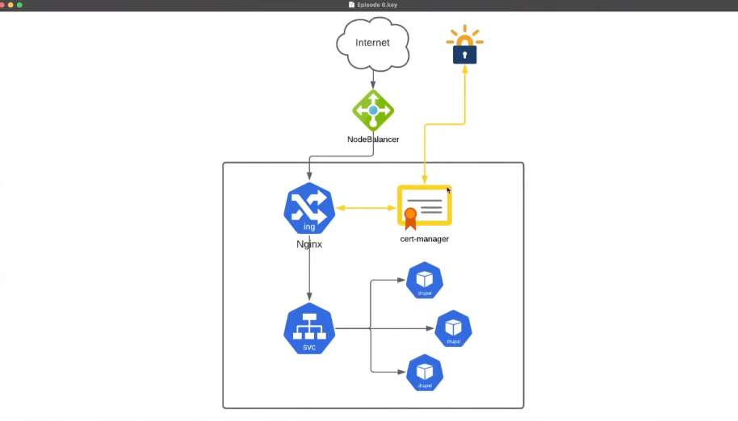
- cluster issuer
- get cluster issuer
  ```
  $ kubectl get clusterissuer
  ```
- proxying the port
  ```
  $ kubectl port-forward -n <namespace> service/<svc-name> <hostport>:<serviceport>

## References:
1. [Shell Hacks](https://www.shellhacks.com/kubectl-create-deployment-command-line/)
2. [Daniel Sanche](https://medium.com/google-cloud/kubernetes-101-pods-nodes-containers-and-clusters-c1509e409e16)